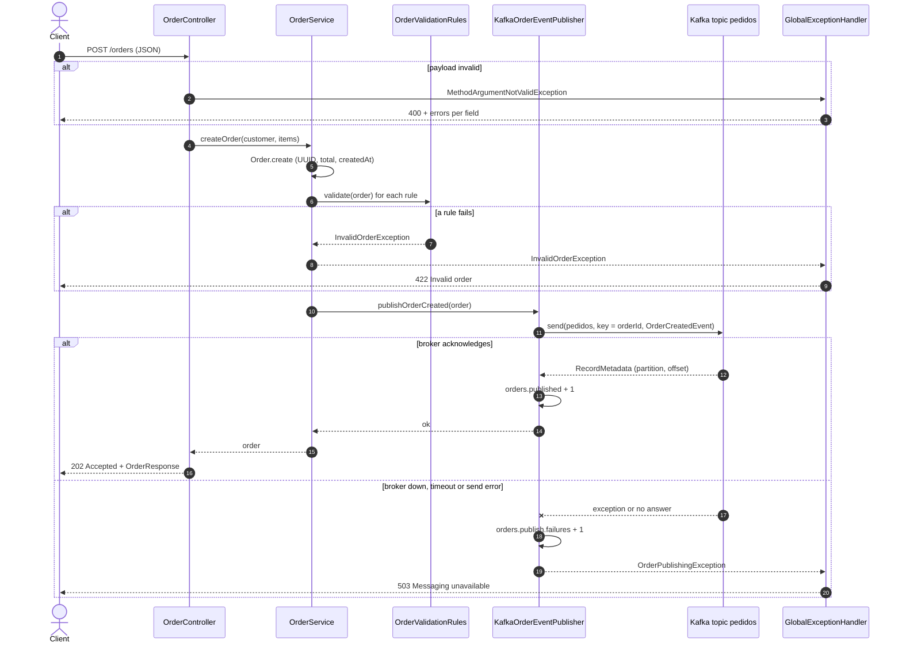

# Create order sequence (order-service)

```mermaid
sequenceDiagram
    autonumber
    actor Client
    participant C as OrderController
    participant S as OrderService
    participant R as OrderValidationRules
    participant P as KafkaOrderEventPublisher
    participant K as Kafka topic pedidos
    participant H as GlobalExceptionHandler

    Client->>C: POST /orders (JSON)
    alt payload invalid
        C->>H: MethodArgumentNotValidException
        H-->>Client: 400 + errors per field
    end
    C->>S: createOrder(customer, items)
    S->>S: Order.create (UUID, total, createdAt)
    S->>R: validate(order) for each rule
    alt a rule fails
        R-->>S: InvalidOrderException
        S-->>H: InvalidOrderException
        H-->>Client: 422 Invalid order
    end
    S->>P: publishOrderCreated(order)
    P->>K: send(pedidos, key = orderId, OrderCreatedEvent)
    alt broker acknowledges
        K-->>P: RecordMetadata (partition, offset)
        P->>P: orders.published + 1
        P-->>S: ok
        S-->>C: order
        C-->>Client: 202 Accepted + OrderResponse
    else broker down, timeout or send error
        K--xP: exception or no answer
        P->>P: orders.publish.failures + 1
        P-->>H: OrderPublishingException
        H-->>Client: 503 Messaging unavailable
    end
```
