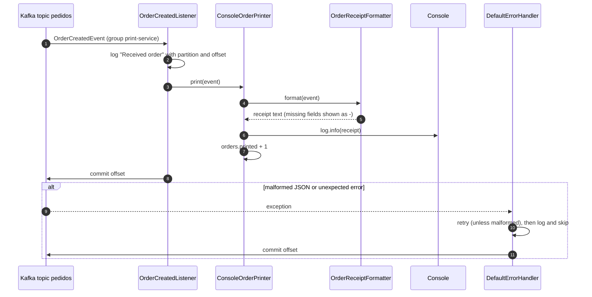

# Print order sequence (print-service)

```mermaid
sequenceDiagram
    autonumber
    participant K as Kafka topic pedidos
    participant L as OrderCreatedListener
    participant P as ConsoleOrderPrinter
    participant F as OrderReceiptFormatter
    participant C as Console
    participant E as DefaultErrorHandler

    K->>L: OrderCreatedEvent (group print-service)
    L->>L: log "Received order" with partition and offset
    L->>P: print(event)
    P->>F: format(event)
    F-->>P: receipt text (missing fields shown as -)
    P->>C: log.info(receipt)
    P->>P: orders.printed + 1
    L->>K: commit offset

    alt malformed JSON or unexpected error
        K-->>E: exception
        E->>E: retry (unless malformed), then log and skip
        E->>K: commit offset
    end
```

This flow runs in parallel with the processing-service and independently of it. If MongoDB is down, receipts are still printed.
